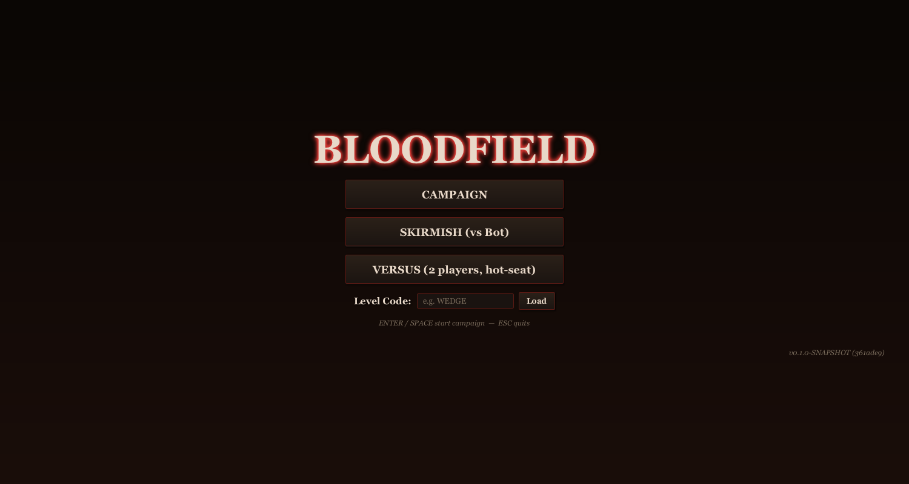
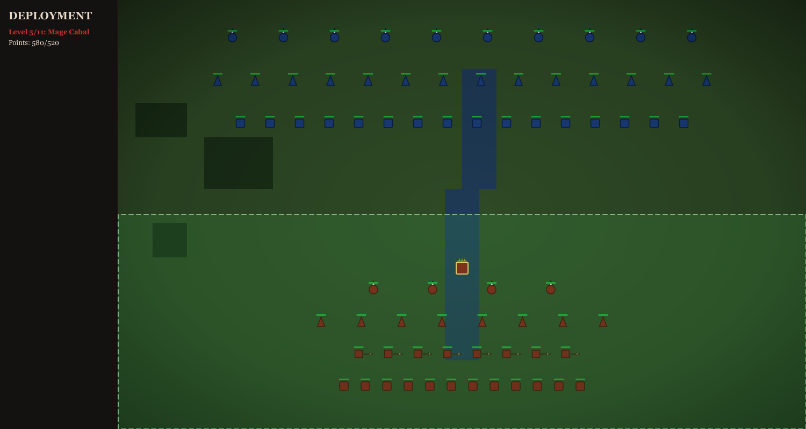
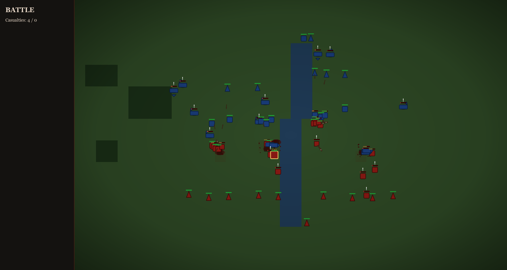
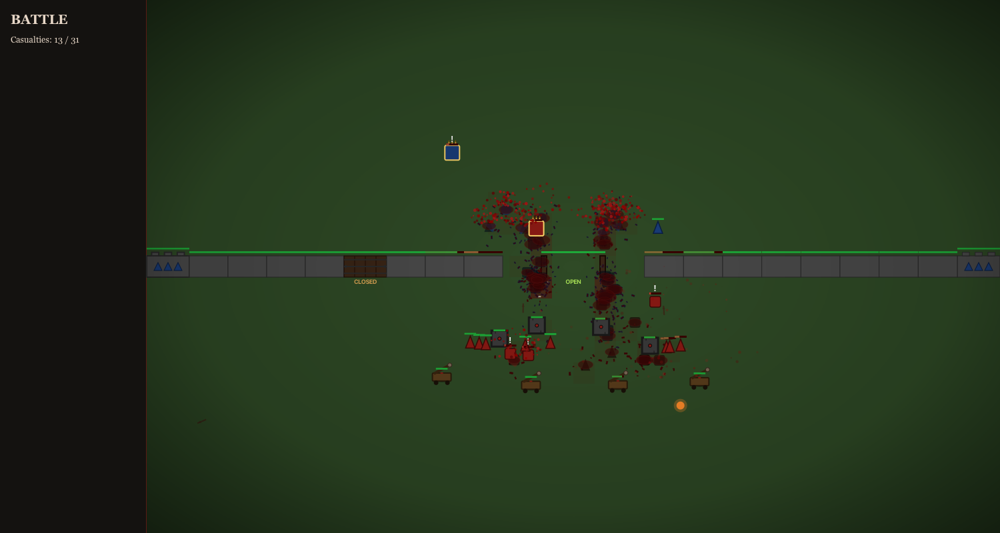
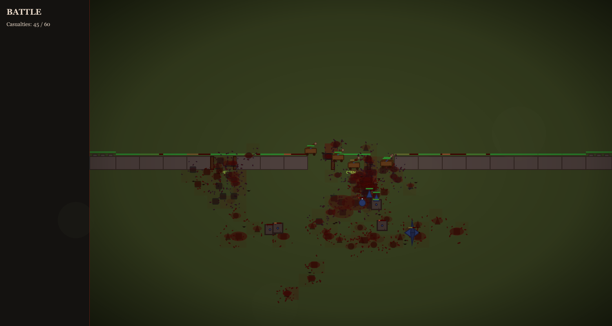

```
   ▓▓▒▒░  ▄▄▄▄▄▄▄▄▄▄▄▄▄▄▄▄▄▄▄▄▄▄▄▄▄▄▄▄▄▄▄▄▄▄▄▄▄▄▄▄▄▄▄▄▄▄▄▄▄▄  ░▒▒▓▓
  ▓▓▒░    ____  _                 _  __ _      _     _   ░▒▓▓
 ▓▒░▒    | __ )| | ___   ___   __| |/ _(_) ___| | __| |   ▒░▓
 ▒░     |  _ \| |/ _ \ / _ \ / _` | |_| |/ _ \ |/ _` |     ░▒
 ░      | |_) | | (_) | (_) | (_| |  _| |  __/ | (_| |      ░
        |____/|_|\___/ \___/ \__,_|_| |_|\___|_|\__,_|
   ░▒▓                                                      ▓▒░
   ▓▒░     armies clash.   bones break.   crows feast.     ░▒▓
   ▒░▓                                                      ▓░▒
   ░▓▒  †   †   †   ▓▒░  ▒▓░  ░▓▒  ░▒▓   †   †   †      ▒▓░
       ╱│╲ ╱│╲ ╱│╲                              ╱│╲ ╱│╲ ╱│╲
        │   │   │     ▓▒░ blood-soil ░▒▓        │   │   │
       ╱ ╲ ╱ ╲ ╱ ╲                              ╱ ╲ ╱ ╲ ╱ ╲
   ▓▓▒▒░░  ▀▀▀▀▀▀▀▀▀▀▀▀▀▀▀▀▀▀▀▀▀▀▀▀▀▀▀▀▀▀▀▀▀▀▀▀▀▀▀▀▀▀▀  ░░▒▒▓▓
```

## Disclaimer

> This game was **fully vibe-coded** — no design doc, no roadmap, no plan beyond
> "make it gnarly". PRs are welcome. New **vibe-coded** features are even more
> welcome. If something's broken, weird, or you have an idea, [open an issue](https://github.com/rzo1/bloodfields/issues).

## About

Bloodfield is a top-down auto-battler. You place an army during a deployment phase,
then watch the carnage unfold in real time — heroes rallying, archers volleying,
cavalry crashing into infantry, dragons charring whole columns. Three modes:
**Campaign** (six escalating levels with codes), **Versus** (2-player hot-seat with
hidden deployment), **Skirmish** (you vs. an AI bot). Heroes carry skills that
buff nearby allies. Terrain matters. Weather matters. Structures hold lines.
Corpses don't disappear — they pile up, blacken, get pecked at by crows, and rot.

## Screenshots

| Main menu | Deployment |
|---|---|
|  |  |

| Battle | Fortress wall |
|---|---|
|  |  |



## Download

Pre-built installers and native CLI binaries for macOS, Windows, and Linux are
published at **<https://rzo1.github.io/bloodfields/>**. Releases are built
automatically by GitHub Actions on every `v*` tag push (matrix across all three
OSes), and the page links straight to the latest artifacts.

## Quickstart

```bash
mvn javafx:run                               # run from source
# or build the fat jar:
mvn -DskipTests package
java -jar target/bloodfields-1.1.0-SNAPSHOT-all.jar
```

Java 21 required. The shade plugin produces `bloodfields-1.1.0-SNAPSHOT-all.jar`
in `target/` — the artifact ID stays as-is to keep build paths stable.

### Regenerate screenshots

The PNGs under `docs/screenshots/` are generated by a headless tool that boots
JavaFX via Monocle, so it works on CI runners without a display server:

```bash
mvn -Pscreenshots verify -DskipTests
```

Outputs go to `docs/screenshots/` (`menu.png`, `deployment.png`, `battle.png`,
`fortress.png`, `finale.png`). The `screenshots` profile pulls in
`org.pdfsam:javafx-monocle` only when activated.

## Headless CLI

There is a JavaFX-free CLI for scripted/LLM play. See `docs/CLI.md` for the full
command reference.

```bash
mvn -DskipTests package
java -cp target/bloodfields-1.1.0-SNAPSHOT-all.jar com.github.rzo1.bloodfields.cli.CliMain levels
java -cp target/bloodfields-1.1.0-SNAPSHOT-all.jar com.github.rzo1.bloodfields.cli.CliMain level 5
printf '%s\n' \
  '{"op":"place","type":"INFANTRY","x":640,"y":700}' \
  '{"op":"start"}' \
  '{"op":"step","ticks":3600}' \
  '{"op":"state"}' \
  '{"op":"quit"}' \
  | java -cp target/bloodfields-1.1.0-SNAPSHOT-all.jar com.github.rzo1.bloodfields.cli.CliMain play 1
```

A `bin/bloodfields-cli` wrapper is included.

## Native installer

Bloodfield can be packaged as a native installer that bundles its own JRE, so
end users do not need to install Java. The build uses `jpackage` (ships with
JDK 17+) wired through the `org.panteleyev:jpackage-maven-plugin`.

```bash
mvn -Ppackage-native package -DskipTests
```

Output goes to `target/installers/`:

| Host OS    | Artifact                              |
|------------|---------------------------------------|
| macOS      | `Bloodfield-<ver>.dmg`                |
| Windows    | `Bloodfield-<ver>.msi`                |
| Linux      | `bloodfield_<ver>_<arch>.deb`         |

The installer type is selected automatically from the host OS. `jpackage` only
produces installers for the platform it runs on — for cross-platform releases,
run the same command on each target OS.

Notes:
- Build requires JDK 17+ on `PATH` (jpackage). The project itself targets Java 21.
- The macOS DMG is unsigned. macOS Gatekeeper will block it on first launch;
  right-click the app and pick "Open" to bypass, or sign it with your own
  Developer ID by adding `--mac-sign` options to the plugin config.
- The Windows MSI is unsigned for the same reason.
- App version is set via the `jpackage.appVersion` Maven property
  (defaults to `1.0.0`); override with `-Djpackage.appVersion=...`.
  jpackage requires the first version segment to be a positive integer,
  which is why this is independent of the project's `1.1.0-SNAPSHOT` version.

## Native binary (GraalVM)

The headless **CLI** (`com.github.rzo1.bloodfields.cli.CliMain`) can be compiled to
a standalone native binary with GraalVM `native-image`. No JVM, no JDK, no
JavaFX — just a single executable that boots in milliseconds. Convenient for
LLM-driven play, scripted simulations, and CI.

This is a separate, complementary path to the jpackage installer above:
`package-native` ships the GUI to end users with a bundled JRE; `package-graal`
ships the headless CLI as a true compiled native binary.

Prerequisites:
- A GraalVM 21+ JDK on `PATH` (or via `GRAALVM_HOME` / `JAVA_HOME`).
  Liberica NIK and Oracle GraalVM both ship `native-image` by default; on
  older distributions install it with `gu install native-image`.

Build:

```bash
mvn -Ppackage-graal package -DskipTests
```

Output: `target/bloodfields-cli` (the binary name is set by the
`graal.imageName` Maven property; override with `-Dgraal.imageName=...`).

`native-image` only walks the call graph reachable from `CliMain`, so the
JavaFX UI tree is not pulled in. If you add new reflective code paths or
dynamic resource lookups in the CLI, harvest the configs by re-running under
the tracing agent:

```bash
mvn -Pcollect-graal-config exec:exec -Dexec.args="<your CLI args>"
```

That writes `reflect-config.json`, `resource-config.json`, etc. to
`src/main/resources/META-INF/native-image/`, which the next `package-graal`
build picks up automatically.

### GUI native build (deferred)

A `package-gui-native` profile is wired for `com.gluonhq:gluonfx-maven-plugin`
as a placeholder, but JavaFX + native-image is significantly harder than the
CLI case: it needs Gluon's Substrate, platform toolchains (Xcode / MSVC /
GCC + dev libs), and exhaustive reachability metadata. **Treat as future
work**; no support claim is made today. End users wanting the GUI should use
`package-native` (jpackage) above.

## Modes

- **Campaign** — Six levels of escalating difficulty. Win a level to receive a
  code that lets you jump back in later without replaying earlier stages.
- **Versus** — Two-player hot-seat. Each player deploys behind a privacy
  blackout, picks a hero skill, and optionally toggles dragon opt-in. Budget is
  configurable from 100 to 10,000 points. Reserves and per-player handicap (HP
  multiplier) round out the matchup.
- **Skirmish** — Single player vs. the bot. Same deployment rules as versus.

## Units

| Unit         | Role            | HP  | Damage | Range | Cost | Notes                                      |
|--------------|-----------------|-----|--------|-------|------|--------------------------------------------|
| INFANTRY     | Melee line      | 50  | 10     | 18    | 10   | Counters archers.                          |
| ARCHER       | Ranged          | 30  | 8      | 180   | 15   | +50% vs cavalry.                           |
| CAVALRY      | Charger         | 80  | 15     | 20    | 25   | +50% vs infantry. Dies to archers.         |
| MAGE         | Ranged AoE      | 35  | 18     | 140   | 30   | Splash 50. Slow, fragile.                  |
| DRAGON       | Boss            | 600 | 80     | 110   | 999  | Flying — ignores terrain and walls. Fire breath. Opt-in only. Never routs. |
| NECROMANCER  | Corpse-bender   | 60  | 8      | 130   | 50   | Revives or detonates corpses.              |
| HEALER       | Support         | 40  | 0      | 80    | 35   | Heals nearby allies. No damage.            |
| CATAPULT     | Siege           | 120 | 35     | 240   | 60   | Splash 70. Boulder projectile.             |
| ASSASSIN     | Skirmisher      | 25  | 22     | 18    | 30   | Fast. Armor-piercing.                      |
| GOLEM        | Tank            | 300 | 20     | 22    | 80   | Slow walking wall. Devastating in melee.   |
| PIKEMAN      | Anti-cavalry    | 55  | 11     | 25    | 15   | Spear line.                                |
| GENERAL      | Hero            | 180 | 18     | 22    | 100  | Unique. +25% damage aura. Carries skill.   |

## Hero Skills

The General can be equipped with one of five auras. Buff applies to allies in range.

- **Battle Lust** — Allies nearby deal +25% damage.
- **Iron Discipline** — Allies nearby take 25% less damage.
- **Swift Strike** — Allies nearby attack 30% faster.
- **Vampiric Banner** — Allies nearby heal 20% of damage dealt.
- **Swift Feet** — Allies nearby move 30% faster.

## Maps

- **Open Plains** — Pure grass. Nowhere to hide.
- **Crossing** — A wide river splits the field; one narrow bridge in the middle.
- **Twin Rivers** — Two rivers, bridges on opposite flanks.
- **Deep Woods** — Dense forest patches break sightlines and slow movement.
- **The Gauntlet** — A diagonal river funnels armies through forest chokepoints.
- **Fortress** — Forest ring walls around the player's deployment zone.
- **Crossroads** — Two perpendicular rivers form a cross with central bridges.
- **The Mire** — Forests everywhere. Slow grinding battle.
- **Peninsula** — Three sides of water funnel armies into a tight battlefield.
- **Badlands** — Scattered forest mounds and a serpentine river.
- **Fortress Wall** — Horizontal wall with twin towers and a central gate.

## Weather

- **Clear** — Cloudless skies. No combat effect.
- **Fog** — Thick fog reduces ranged attack range by 30%.
- **Rain** — Soaked ground slows units by 15%.
- **Snow** — Cosmetic. Falls quietly on the dead.
- **Night** — Darkness reduces ranged attack range by 20%.

## Controls

| Key       | Action                                  |
|-----------|-----------------------------------------|
| `1`       | 0.5× speed                              |
| `2`       | 1× speed (normal)                       |
| `3`       | 2× speed                                |
| `4`       | 4× speed                                |
| `P`       | Pause / unpause                         |
| `R` / `B` | Bring in reserves                       |
| `?` / `H` | Toggle controls & help overlay          |
| `ESC`     | Back to main menu                       |
| `ENTER`   | Start campaign / confirm                |
| `SPACE`   | Start campaign (from result screen)     |

## Gore features

- Blood splashes on every kill, scaled to the size of the unit that died.
- Corpses persist on the field — they don't despawn. Necromancers can revive
  them or blow them up (friendly fire included).
- Bloody tile overlay accumulates where the slaughter is heaviest.
- Decomposing remains darken over ~30 seconds before settling into bone piles.
- Severed limbs and stuck arrows litter the battlefield.
- Charred corpses where dragon fire passed through.
- Scorch marks from catapult splash.
- Crows circle, then descend on the casualty fields. Vultures pick at bones.
- Screen shake on heavy impacts. Catapult boulders, dragon strafes, golem
  slams.
- Casualty-darkened vignette — the more bodies, the darker the screen edges.
- Red sky on later campaign levels. The sun gives up.

```
░▒▓ † † † † † † † † † † † † † † † † † † † † † † † † † † † † † † † † † † † † † † ▓▒░
```
